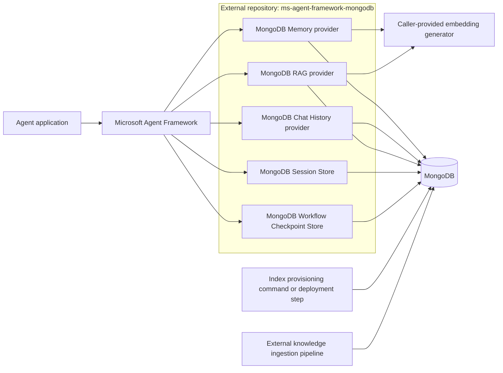
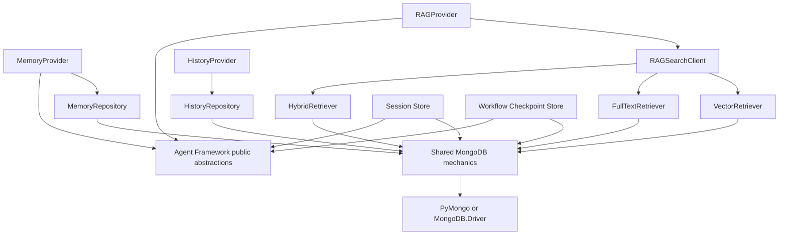
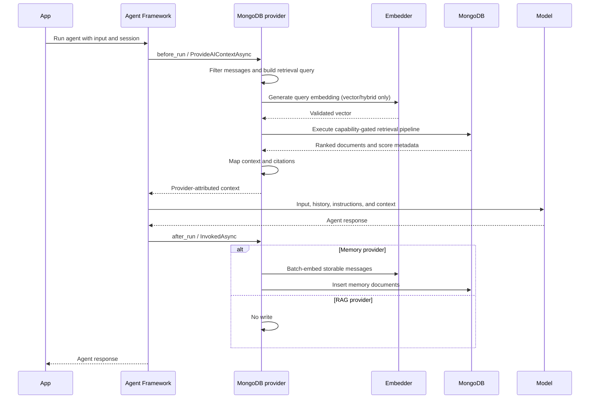
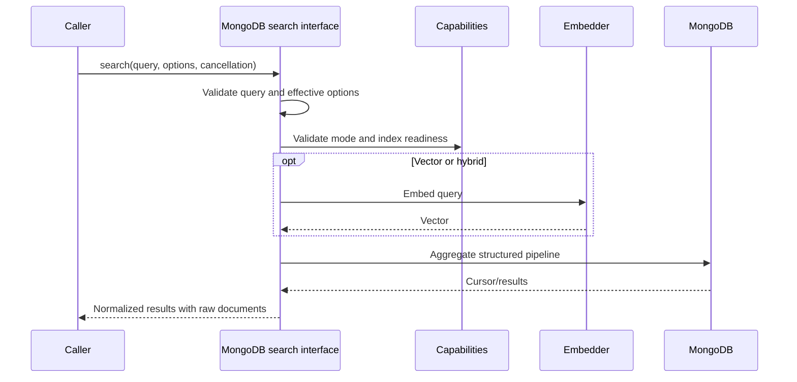

# System Architecture

## System architecture

### Context diagram



The provider repository owns the adapters between Agent Framework and MongoDB. It does not own the model endpoint,
application authentication, production knowledge-ingestion pipeline, or Microsoft Agent Framework runtime.

### Exact Agent Framework integration contracts

#### Python

Python Memory and RAG providers MUST derive from the current public `ContextProvider` abstraction and implement:

- `before_run(...)` for retrieval and context injection
- `after_run(...)` for Memory persistence only
- asynchronous resource cleanup through `close()` and async context-manager methods when the provider owns resources

RAG MUST implement `before_run(...)` and MUST NOT perform writes in `after_run(...)`. If the base abstraction requires
an `after_run(...)` implementation, it MUST be a no-op.

Messages added through `SessionContext.extend_messages(source_id, messages)` MUST use a stable provider source ID so
chat-history and Memory filters can identify provider-generated context. The provider MUST use current Agent Framework
types and MUST NOT target obsolete beta context-provider abstractions found in older integration examples.

Python exact Chat History MUST derive from the public `HistoryProvider` exported by `agent_framework` and implement
`get_messages(...)` and `save_messages(...)`. It SHOULD use the base class's loading, storage filtering, context-source
handling, and invocation sequencing rather than reimplementing `before_run(...)` and `after_run(...)`.

Python Session Store MUST provide `MongoDBSessionStore(SessionStore)` through `get`, `set`, and `delete`, using
`AgentSession`'s supported public serialization contract. Python Workflow Checkpoint Store MUST provide
`MongoDBCheckpointStorage(CheckpointStorage)` and implement `save`, `load`, `list_checkpoints`, `delete`, `get_latest`,
and `list_checkpoint_ids`. Both adapters MUST reject incompatible framework or payload versions with migration
guidance and MUST NOT depend on non-public framework surfaces.

#### .NET

.NET Memory MUST implement the current `AIContextProvider`/`MessageAIContextProvider` contract through public Agent
Framework abstractions. It MUST preserve source attribution and provider-session state behavior supplied by the base
types.

.NET exact Chat History MUST derive from the public `ChatHistoryProvider` abstraction and preserve its retrieval,
merge, source-stamping, input/output filtering, and session-state conventions.

.NET RAG MAY compose the sealed Agent Framework `TextSearchProvider` around a MongoDB search delegate. It MUST NOT
subclass `TextSearchProvider`, because that class is sealed. Composition can retain framework behavior for:

- before-invoke retrieval
- optional on-demand function retrieval
- recent-message query context
- source-name and source-link formatting
- citation instructions
- provider state serialization
- message filtering
- logging redaction and fail-open agent invocation

The current `TextSearchProvider` catches all exceptions from before-invoke retrieval, including cancellation. Before
selecting composition, the implementation MUST add a focused compatibility test for cancellation, direct result
mapping, citations, score/metadata preservation, and on-demand tool behavior. If the current framework contract cannot
satisfy unconditional cancellation propagation or required result semantics, MongoDB RAG MUST use a dedicated
`AIContextProvider` adapter while reusing framework formatting conventions where possible. It MUST NOT duplicate
`TextSearchProvider` casually or claim stronger behavior than composition provides.

.NET Workflow Checkpoint Store MUST provide `MongoDBCheckpointStore` deriving from the supported public
`JsonCheckpointStore`. Session persistence MUST provide `MongoDBAgentSessionStore`, implement the supported public
Agent Framework session-hosting contract, and use supported `AIAgent` session serialization. Neither adapter may
serialize internal runtime objects independently. Exact supported dependency versions are Foundation verification
inputs and release prerequisites.

### Internal module decomposition

The following logical modules are REQUIRED. File names may follow language conventions.

```text
shared/internal
├── client_factory          # Construct clients only when connection settings are supplied
├── ownership               # Record which resources are provider-owned
├── capabilities            # Deployment/server/driver/mode capability checks
├── index_management        # Create, list, validate, poll, update, and drop indexes
├── field_paths             # Validate and resolve configured nested paths
├── filters                 # Typed filters and mode-specific translation
├── embeddings              # Normalize framework embedding generators and validate vectors
├── result_mapping          # BSON/document conversion and source metadata
└── errors                  # Stable integration exception categories

memory
├── provider                # Agent Framework lifecycle adapter
├── options                 # Public configuration
├── scope                   # Application/agent/user/session scoping
├── document_mapper         # Message-to-document and document-to-memory mapping
├── repository              # Insert and vector-search operations
└── index                   # Memory index definition and validation facade

history
├── provider                # Exact Agent Framework history adapter
├── options                 # Ordering, retention, filtering, and scope options
├── document_mapper         # Lossless message serialization
├── repository              # Ordered append/read/delete operations
└── indexes                 # Compound ordering/uniqueness and optional TTL indexes

rag
├── provider                # Agent Framework lifecycle adapter
├── options                 # Public configuration
├── search_client           # Public direct-search interface
├── vector_retriever        # ANN/ENN pipeline
├── fulltext_retriever      # Search pipeline
├── hybrid_retriever        # Native rank-fusion pipeline
├── enrichment              # Approved post-retrieval stages
├── result                  # Normalized RAG result
└── index                   # RAG index definitions and validation facade

session_store
├── store                   # Serialized AgentSession get/set/delete
├── serializer              # Framework-supported snapshot envelope
└── indexes                 # Isolation key, version, and optional TTL

checkpointing
├── store                   # Save/load/list/latest/delete
├── document_mapper         # Versioned workflow checkpoint envelope
└── indexes                 # Workflow/session lineage and latest lookup
```

### Dependency direction



Dependencies MUST point inward toward MongoDB mechanics. Shared code MUST NOT depend on Memory or RAG provider types.
Memory, Chat History, RAG, Session Store, and Workflow Checkpoint Store MUST NOT call each other. Cross-language code
generation is not required; behavioral parity is enforced through specifications and fixtures.

### Public versus internal interfaces

Public interfaces SHOULD expose application concepts: provider, options, scope, search mode, result, index validation,
and explicit provisioning. These details MUST remain internal unless a demonstrated caller requirement exists:

- raw aggregation pipeline assembly
- score metadata projection aliases
- driver cursor types
- polling implementation
- capability command responses
- embedding-generator adaptation
- ownership flags
- serializer conventions

### Resource ownership matrix

| Resource supplied to provider | Owner | Provider cleanup behavior |
| --- | --- | --- |
| Connection string/settings only | Provider | Create and dispose client |
| Injected MongoDB client | Caller | Never dispose |
| Injected database | Caller | Never dispose underlying client |
| Injected collection | Caller | Never dispose underlying client |
| Provider-created Vector Store wrapper | Provider, subject to connector contract | Dispose wrapper without double-disposing client |
| Injected embedding generator | Caller | Never dispose unless an explicit ownership option is added |

Ownership MUST be fixed at construction and MUST NOT change after a failed operation. Tests MUST verify both successful
and exceptional cleanup paths.

### Agent invocation lifecycle



### Direct search lifecycle

Both languages MUST expose a public direct-search method independent of agent invocation. This is the primary test
surface and enables applications to inspect results before context formatting.



Direct search MUST surface errors. Agent-hook adapters MAY apply documented fail-open behavior after cancellation and
configuration errors have been excluded.
