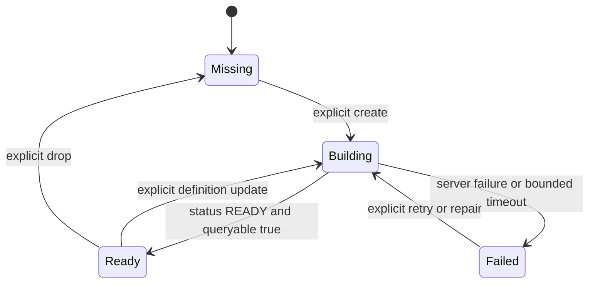

# Index Management

This specification applies to both Memory and RAG index facades and their shared internal index manager.

## RAG index lifecycle

- Assume the knowledge collection is pre-ingested.
- Provide validation helpers for required vector and Search indexes.
- Index creation, document chunking, embedding backfill, and bulk ingestion are deployment concerns, not side effects
  of `before_run` or `ProvideAIContextAsync`.
- Samples may include explicit bootstrap helpers to create a small demonstration collection and indexes.
- Production documentation must explain MongoDB Search index readiness and required privileges.

## Index-management interface

Memory and RAG MAY expose feature-specific facades, but both MUST delegate to one internal index manager with equivalent
operations:

```text
list indexes
inspect named index
validate expected definition (read-only)
ensure expected definition (explicit create/update plus bounded polling)
create index
update index
wait until queryable
drop index
```

The public interface SHOULD use explicit methods such as:

```python
await provider.validate_indexes()
await provider.ensure_indexes(wait_until_ready=True, timeout=timedelta(minutes=10))
```

```csharp
await provider.ValidateIndexesAsync(cancellationToken);
await provider.EnsureIndexesAsync(waitUntilReady: true, timeout, cancellationToken);
```

`validate_*` MUST be read-only. `ensure_*` MUST be an explicit application/deployment action and MUST NOT be called by
agent lifecycle hooks or direct search. A successful create/update command means the asynchronous build was accepted;
it does not mean the index is queryable.

Validation MUST compare every applicable property:

- index name and Search versus Vector Search type
- indexed vector path
- vector dimensions
- vector similarity
- required vector filter paths
- required Search text paths/analyzers where inspectable
- index `status`
- `queryable == true`

Definition comparison MUST tolerate server-added defaults and unordered BSON object fields while rejecting semantic
differences. Secrets and full index command responses MUST not appear in ordinary logs.

## Index state machine



Polling MUST:

- use a monotonic deadline
- support cancellation on every request and delay
- use a bounded interval with configurable timeout
- fetch only the named index when the driver/API permits it
- distinguish failed, missing, building, ready-but-not-queryable, and timeout states
- return the final inspected definition on success
- include the index name, last known state, and remediation in errors

Index managers MUST NOT retry a failed definition automatically. Update MUST be explicit because changing a production
index may consume substantial resources or change retrieval behavior.

## Required privileges by operation

Documentation MUST give separate least-privilege guidance for:

| Role/workload | Required operation categories |
| --- | --- |
| RAG runtime | Read/aggregate on knowledge collection and Search query permissions |
| Memory runtime | Read/aggregate/insert on memory collection and Search query permissions |
| Index provisioner | List/create/update/drop Search indexes on approved collections |
| Integration tests | Create/drop test-prefixed collections and indexes in isolated database |

Runtime identities SHOULD NOT receive index-management privileges. Exact built-in/custom MongoDB roles MUST be verified
against the target deployment and documented before package publication.
