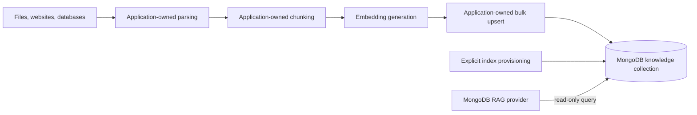

# Knowledge Ingestion and Bootstrap Boundary

## Knowledge ingestion and bootstrap boundary

Production RAG ingestion is intentionally outside the runtime package. The provider consumes an existing collection
whose chunks, embeddings, metadata, tenancy fields, and indexes satisfy its configuration.

The runtime provider MUST NOT:

- fetch or parse source documents
- choose an application chunking strategy
- backfill or refresh embeddings
- provide connector ecosystems, OCR, crawling, scheduling, or durable ingestion orchestration
- create indexes during a query
- upsert retrieved documents
- infer tenant authorization from document content

The repository MAY include a sample-only bootstrap utility. It MUST be clearly labeled non-production, accept only
local/sample inputs, use deterministic IDs for idempotent reruns, create test/sample-prefixed resources, wait for index
readiness, and support cleanup. It MUST call the same embedding abstraction and index manager as the provider so samples
exercise public behavior without creating a second production ingestion API.

### Ingestion compatibility contract

Documentation MUST define the input collection contract for each sample:

- identifier type
- chunk-text field and encoding
- embedding field, numeric representation, dimensions, and model
- source title and URL fields
- metadata representation
- tenant/security fields
- index definitions

The embedding model used at query time MUST be compatible with stored vectors. Provider startup validation MAY compare
a caller-supplied embedding model identifier stored in collection metadata, but no universal model-name convention is
required initially.
